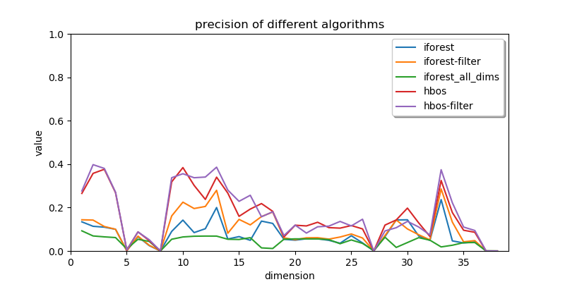

# 针对 SMD 数据集单维度时间序列的异常检测学习报告

代码仓库地址：[IceyBlackTea/smd-anomaly-detection](https://github.com/iceyblacktea/smd-anomaly-detection)

## 1. 任务目标

使用 [OmniAnomaly](https://github.com/NetManAIOps/OmniAnomaly) 仓库提供的数据集 SMD (Server Machine Dataset) ，将原始的多维度时间序列转为多个单维度时间序列，选择合适的低开销算法和优化方式，在各自维度上进行异常检测，得出性能指标。

## 2. 数据集

SMD 数据集包含了多个机器在一段时间内，共计 38 个维度的多维时间序列。

数据集在对多维时间拆分为训练集与测试集的基础上，对测试集的异常序列进行了标记，并同时提供了各个异常对应多个维度的解释文件。

## 3. 选择的基础算法

在本次学习过程中，我选择调用 PYOD 库的各个算法实现。

由于 SMD 数据集的训练集不包含标记数据，所以选择能够进行无监督学习的常用低开销算法进行对比。

### Isolation Forest

利用决策树的特点，多次对特征空间进行划分，通过观察隔离某一个点的难易程度，判断某个点是否为异常点。由于异常点往往在密度较低的地方， 所以更容易被隔离。

隔离森林算法具有线性时间复杂度，并可以并行计算，可以适用于大型数据。

### HBOS

通过将样本按照特征分为多个区间，样本数较少的区间是异常值的概率较大。

HBOS 算法具有线性时间复杂度，并可以并行计算，可以适用于大型数据。

### KNN

计算某个点距离第 k 个近邻点的距离，这个距离越大，那么该点就越有可能是异常点。

KNN 算法需要大量计算距离，运算开销较大。

### LOF

通过计算某个点在局部区域上的密度与其邻接点的密度来判断该点的异常程度。

LOF 算法需要大量计算距离，运算开销较大。

### COPOD

计算一个样本在多个维度是异常的可能性，最后合并各维度结果。

COPOD 算法运行快，需要调整的参数少。

## 4. 验证评估指标

原始数据在测试集的分类标记基础上，还有各异常对应的多维度解释。

因此，在对某个单维度计算评估指标时，仅统计该单维度相关的异常情况。

指标主要观察以下几类数据:

- F1 分数 f1
- 准确率 accuracy
- 精度 precision
- 召回率 recall
- 训练时间 train_time
- 预测时间 predict_time

## 5. 基础算法验证

在使用各个基础算法对数据集进行训练和验证后，对不同机器的同一维度的各项指标进行了平均值统计，

各类指标结果如下：

> 由于选择原始数据集注明的约4%，各算法在异常点比例参数上选择 0.04。
> 不同指标数据范围不同，各图的 Y 轴区间存在区别。
> 部分维度结果为 0，主要原因是该维度可能整个时间序列值均为 0。

从验证结果来看：

- 各种基础算法对各个维度均达不到较好的检测效果。
- 不同基础算法在各个维度的检测效果相近且较差，
  这说明某些维度的数据异常特点使用基础的算法进行判断存在一定的难度。
- 基础算法的准确率往往远高于精度与召回率，这说明基础算法对于非异常的判断比较容易出现问题。
- 部分算法训练和预测的时间消耗差距巨大，这充分说明低开销算法的重要性。

综合各项数据来看，HBOS 算法对该数据集进行异常检测较其他基础算法效果更好。

## 6. 问题分析与改进想法

结合可视化数据观察，基础算法对于单维度的判断结果比较符合人的视觉观察结果，基础算法能够比较正确的找出数据范围变化较大较快的区间。

但通过标记认识到，部分数据范围变化较大较快的情况并不一定属于异常，且检测结果可能存在大量离散点，如：

> 标记点为检测出或标记中异常点，其中绿点为 TP，红点为 FP，蓝色为 FN。

### 将多维度时间序列拆分为单维度时间序列丢失了维度间的联系信息

拆分的单维度数据异常点概率可能变低，部分异常点从单维度可能无法进行判断，需要多维度进行综合判断。

### 检测结果容易出现大量离散的异常点

一些数据存在大量的大范围数据突变的情况，这非常容易被异常检测算法判定为异常，需要一定的过滤。

## 7. 可能的优化方式

目的考虑的改进方向可分为两类：

### 优化维度间的统计方式，将不同维度的检测结果结合判断
  
在尝试恢复维度间关系的过程中发现，维度间的关系难以通过简单的建模关系描述，且对不同维度间进行分析的优化方式可能会引入大量的额外开销，损伤算法原本的高效、低开销的特点。

为了模拟异常检测过程中考虑维度间关系的算法，最后选用了原始的 IForest 算法，区别是将原始的多维情况输入，对应的结果为 iforest_all_dims。

### 过滤掉不太可能为异常的检测点

这一优化方式较为实现，在算法的预测结果中，重新遍历，去除掉周围异常点较少的检测点。

对 IForest 与 HBOS 算法都进行了测试，对应结果为 iforest-filter 与 hbos-filter。

## 8. 优化方式验证

在使用几种算法对数据集进行训练和验证后，对不同机器的同一维度的各项指标进行了平均值统计，

各类指标结果如下：

观察到：

- 虽然使用多维度的iforest算法进行了验证，但其优势主要体现在召回率上，其他方面不如单维度的算法。
  这充分说明维度间的关系比较复杂，难以使用基础算法直接得出。

- 简单的尝试过滤异常点的优化方式在一些指标下不一定带来更好效果，但从总体上看，过滤后的情况优于原始版本。
  这说明这种优化方式有一定可取性，或许可以通过更精确的参数调整达到更好效果。

- 完全的无监督的基础检测算法可能不适合该数据集，可能需要换用功能更强的其他类型算法。

## 9. 结论与学习收获

异常检测是一个困难的问题。无论是单维度还是多维度，异常检测在数据上往往是无标签可用、异常点数量极少、异常原因复杂。

不同的算法有不同的特点，但可能都无法合适地解决问题。无监督的基础检测算法计算过程简单，速度快，开销小，但可能效果较差：
如从本次实验来看，选用不同的检测基础算法都不能得到较好的效果。

了解场景产生异常的原因能够更好地分析数据，帮助改善异常检测的效果；通过对特定场景的数据情况进行更好的分析，优化算法和调整参数以获取更好的效果。
